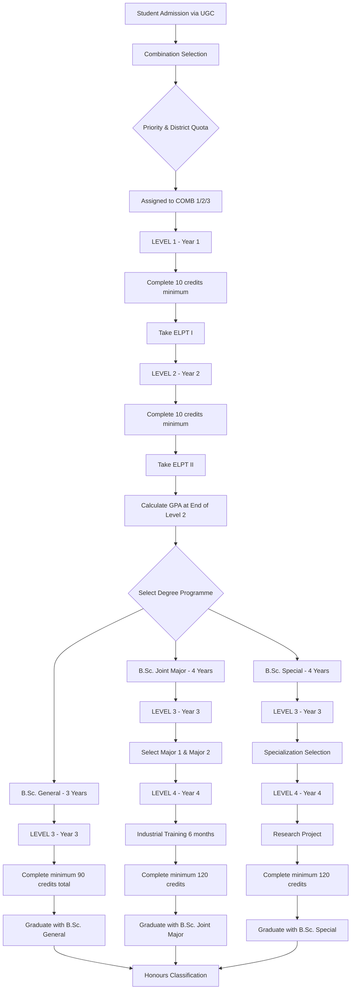

# WUSL Faculty of Applied Sciences - Academic Flow Documentation

## Table of Contents
1. [Introduction](#introduction)
2. [Academic Structure Overview](#academic-structure-overview)
3. [Complete Academic Workflow](#complete-academic-workflow)
4. [Subject Combinations](#subject-combinations)
5. [Degree Programmes](#degree-programmes)
6. [Registration Process](#registration-process)
7. [Evaluation & Grading System](#evaluation--grading-system)
8. [GPA Calculation](#gpa-calculation)
9. [Degree Requirements](#degree-requirements)
10. [Honours Classification](#honours-classification)
11. [Important Timelines](#important-timelines)

---

## Introduction

The Faculty of Applied Sciences at Wayamba University of Sri Lanka (WUSL) follows a **course credit system** with modular structure, offering three types of undergraduate degrees:
- 3-Year B.Sc. (General) Degree
- 4-Year B.Sc. (Joint Major) Degree
- 4-Year B.Sc. (Special) Degree

**Medium of Instruction:** English

---

## Academic Structure Overview

### Academic Calendar
- **Academic Year:** 2 semesters × 15 weeks each
- **Study Leave:** 2 weeks before examinations
- **Examination Period:** 4 weeks per semester

### Credit System
- **1 Credit = 15 lecture hours** (1 hour/week for 15 weeks)
- **1 Credit = 30-45 practical hours** (2-3 hours/week for 15 weeks)

### Department Structure

| Department | Subject Code | Subject Areas |
|------------|--------------|---------------|
| Computing & Information Systems | CMIS | Computer Science, IT Systems |
| Electronics | ELTN | Applied Electronics, Embedded Systems |
| Industrial Management | IMGT | Business Management, Operations |
| Mathematical Sciences | MATH, MMOD, STAT | Mathematics, Modelling, Statistics |

---

## Complete Academic Workflow



---

## Subject Combinations

### Available Combinations at Level 1 & 2

Students MUST select one combination and study all three subjects:

| Combination | Subject 1 | Subject 2 | Subject 3 |
|-------------|-----------|-----------|-----------|
| **COMB 1** | MATH & STAT | CMIS | ELTN |
| **COMB 2** | MATH & STAT | ELTN | IMGT |
| **COMB 3** | MATH & STAT | IMGT | CMIS |

### Selection Criteria
1. **Student Preference:** 1st, 2nd, 3rd choice
2. **District Quota:** Number of students from each district
3. **A/L Z-Score:** Higher scores get priority

### Combination Split at Level 3 (B.Sc. General Only)

For General Degree students, MATH & STAT can be split into separate subjects:

**Example for COMB 1:**
- COMB 1A: MATH + CMIS + ELTN
- COMB 1B: STAT + CMIS + ELTN
- COMB 1C: MATH + STAT + CMIS

---

## Degree Programmes

### 1. B.Sc. (General) Degree - 3 Years

**Duration:** 3 academic years (Levels 1, 2, 3)

**Requirements:**
- Minimum **90 credits** total
- Maximum **99 credits** total
- At least **30 credits per level**
- **24 credits** minimum from each of 3 subject areas (with grade C or better)
- Minimum GPA: **2.00**
- Pass **ELPT I & II**
- Complete within **5 academic years**

**Structure:**
```
Level 1: 30 credits (3 subjects)
Level 2: 30 credits (3 subjects)
Level 3: 30 credits (3 subjects)
Total: 90 credits minimum
```

---

### 2. B.Sc. (Joint Major) Degree - 4 Years

**Duration:** 4 academic years (Levels 1, 2, 3, 4)

**Selection Criteria (at End of Level 2):**
- Overall GPA ≥ **2.5**
- Pass ELPT I & II
- Pass departmental interview
- Y-Score calculation for Major 1 selection:
  ```
  Y = 0.6 × (Average marks in chosen Major 1) + 0.4 × (Average marks in other subjects)
  ```

**Requirements:**
- Minimum **120 credits** total
- Maximum **132 credits** total
- At least **30 credits per level**
- **45 credits** from Major 1 (with grade C or better)
- **45 credits** from Major 2 (with grade C or better)
- Minimum GPA: **2.00**
- Pass **ELPT I & II**
- Complete **6-month Industrial Training** at Level 4
- Complete within **6 academic years**

**Available Combinations:**

| Code | Major 1 | Major 2 | Level 1-2 Subject |
|------|---------|---------|-------------------|
| 1A | CMIS (52) | ELTN (46) | MATH & STAT (25) |
| 1B | CMIS (52) | MMST (48) | ELTN (20) |
| 2A | ELTN (52) | CMIS (46) | MATH & STAT (25) |
| 2B | ELTN (52) | MMST (48) | IMGT (20) |
| 3A | IMGT (52) | ELTN (46) | MATH & STAT (25) |
| 3B | IMGT (52) | MMST (48) | CMIS (20) |

*(Numbers in brackets indicate maximum credits available)*

---

### 3. B.Sc. (Special) Degree - 4 Years

**Duration:** 4 academic years (Levels 1, 2, 3, 4)

**Selection Criteria (at End of Level 2):**
- All grades **≥ C** for registered modules
- Overall GPA ≥ **2.5** AND Subject GPA ≥ **3.0**
  - OR Subject GPA ≥ **3.7** (overall GPA can be 2.5)
- Pass ELPT I & II
- Pass departmental interview

**Requirements:**
- Minimum **120 credits** total
- Maximum **132 credits** total
- At least **30 credits per level**
- **72 credits** minimum from specialization area (with grade C or better)
- Minimum GPA: **2.00**
- Pass **ELPT I & II**
- Complete **Research Project** at Level 4
- Complete within **6 academic years**

**Available Specializations:**
1. B.Sc. (Special) in Computer Science
2. B.Sc. (Special) in Applied Electronics
3. B.Sc. (Special) in Industrial Management
4. B.Sc. (Special) in Mathematics with Statistics

---

## Registration Process

### Annual Registration Steps

```
1. Semester I Time Table Announced
        ↓
2. Student reviews module options
        ↓
3. Complete Course Registration Form
        ↓
4. Submit through Student Counsellor
        ↓
5. Assistant Registrar receives form
        ↓
6. Registration confirmed (within 2 weeks)
        ↓
7. No changes allowed after 2 weeks
```

### Credit Requirements

| Requirement | Credits |
|-------------|---------|
| Annual Minimum | 30 |
| Annual Maximum | 33 |
| Includes | All compulsory modules |
| Excludes | Auxiliary/Enhancement courses |

### Important Rules
- ✅ Must register before each academic year
- ✅ Registration deadline: First 2 weeks of academic year
- ❌ No changes after 2 weeks
- ❌ Cannot sit exam without registration
- ⚠️ Must maintain 80% attendance minimum

---

## Evaluation & Grading System

### Module Evaluation Structure

**Overall Mark = 70% (End-Semester Exam) + 30% (Continuous Assessment)**

### Continuous Assessment Components
- Assignments
- Mid-semester tests
- Presentations
- Reports
- Laboratory work

### Eligibility Requirements

**To sit for End-Semester Examination:**
- Minimum **30%** weighted mean score in continuous assessments
- Maintain **80%** attendance

**If Not Eligible:**
- Receive grade **"I"** (Incomplete)
- Must redo continuous assessments
- Can sit exam at next available opportunity

---

## Grading System

### Grade Scale

| Marks Range | Grade | Grade Point | Description |
|-------------|-------|-------------|-------------|
| 85 - 100 | A+ | 4.0 | Superior Performance |
| 70 - 84 | A | 4.0 | Excellent |
| 65 - 69 | A- | 3.7 | Very Good |
| 60 - 64 | B+ | 3.3 | Good, clearly above average |
| 55 - 59 | B | 3.0 | Above average |
| 50 - 54 | B- | 2.7 | Average performance |
| 45 - 49 | C+ | 2.3 | Quite Satisfactory |
| 40 - 44 | C | 2.0 | Pass - basic understanding |
| 35 - 39 | C- | 1.7 | Satisfactory |
| 30 - 34 | D+ | 1.3 | Weak |
| 25 - 29 | D | 1.0 | Quite Weak |
| 0 - 24 | E | 0.0 | Very weak / Fail |
| - | I | 0.0 | Incomplete |

### Grade Point Features
- Grade **C** = Minimum pass grade (2.0)
- Grades **D+, D, E** = Fail grades
- Grade **I** = Incomplete (not eligible or absent)

---

## GPA Calculation

### Formula

```
GPA = Σ(Grade Point × Credits) / Σ(Credits)
```

### Calculation Example

| Module | Credits | Marks | Grade | GP | Weighted GP |
|--------|---------|-------|-------|----|----|
| CMIS1113 | 3 | 85 | A+ | 4.0 | 12.0 |
| MATH1112 | 2 | 72 | A | 4.0 | 8.0 |
| STAT1113 | 3 | 68 | A- | 3.7 | 11.1 |
| ELTN1112 | 2 | 55 | B | 3.0 | 6.0 |
| **Total** | **10** | - | - | - | **37.1** |

**GPA = 37.1 ÷ 10 = 3.71**

### GPA Types

1. **Semester GPA:** Calculated per semester
2. **Annual GPA:** Calculated per academic year
3. **Level GPA:** Calculated per level (1, 2, 3, or 4)
4. **Cumulative GPA:** Overall GPA across all levels
5. **Subject GPA:** GPA for specific subject area

### Important Notes
- All registered modules counted (except auxiliary courses)
- Incomplete grades (I) count as 0.0
- GPA calculated to **2 decimal places**
- Failed modules must be repeated

---

## Degree Requirements

### Minimum Requirements Summary

| Degree Type | Duration | Min Credits | Min GPA | Special Requirements |
|-------------|----------|-------------|---------|---------------------|
| **B.Sc. General** | 3 years | 90 | 2.00 | 24 credits/subject (C or better) |
| **B.Sc. Joint Major** | 4 years | 120 | 2.00 | 45 credits/major (C or better) |
| **B.Sc. Special** | 4 years | 120 | 2.00 | 72 credits in specialization (C or better) |

### Common Requirements (All Degrees)
- ✅ Pass ELPT I (Level 1)
- ✅ Pass ELPT II (Level 2)
- ✅ Complete Career Guidance Programme (Level 3)
- ✅ Maintain minimum GPA 2.00
- ✅ Complete within maximum time limit

### Credit Distribution

**B.Sc. General Degree:**
```
Subject 1: 24+ credits (Grade C or better)
Subject 2: 24+ credits (Grade C or better)
Subject 3: 24+ credits (Grade C or better)
Remaining: 18+ credits
Total: 90 credits minimum
```

**B.Sc. Joint Major:**
```
Major 1: 45+ credits (Grade C or better)
Major 2: 45+ credits (Grade C or better)
Level 1-2 Subject: 20-25 credits
Remaining: 5-10 credits
Total: 120 credits minimum
```

**B.Sc. Special:**
```
Specialization: 72+ credits (Grade C or better)
Level 1-2 Subjects: 20 credits
Research Project: 8 credits
Remaining: 20 credits
Total: 120 credits minimum
```

---

## Honours Classification

### B.Sc. (General) Degree Honours

| Class | Min GPA | Additional Requirements |
|-------|---------|------------------------|
| **First Class** | 3.70 | • 90+ credits with C or better<br>• All other modules ≥ C<br>• 45+ credits with A or better<br>• Complete in 3 years |
| **Second (Upper)** | 3.30 | • 84+ credits with C or better<br>• Remaining modules ≥ C-<br>• 45+ credits with B or better<br>• Complete in 3 years |
| **Second (Lower)** | 3.00 | • 80+ credits with C or better<br>• Remaining modules ≥ C-<br>• 45+ credits with B or better<br>• Complete in 3 years |
| **Pass** | 2.00 | • Meet minimum requirements |

---

### B.Sc. (Joint Major) Degree Honours

| Class | Min GPA | Additional Requirements |
|-------|---------|------------------------|
| **First Class** | 3.70 | • 120+ credits with C or better<br>• All other modules ≥ C<br>• 60+ credits with A or better<br>• 45+ credits each major (C or better)<br>• Complete in 4 years |
| **Second (Upper)** | 3.30 | • 112+ credits with C or better<br>• Remaining modules ≥ C-<br>• 60+ credits with B or better<br>• 45+ credits each major (C or better)<br>• Complete in 4 years |
| **Second (Lower)** | 3.00 | • 104+ credits with C or better<br>• Remaining modules ≥ C-<br>• 60+ credits with B or better<br>• 45+ credits each major (C or better)<br>• Complete in 4 years |
| **Pass** | 2.00 | • Meet minimum requirements |

---

### B.Sc. (Special) Degree Honours

| Class | Min GPA | Additional Requirements |
|-------|---------|------------------------|
| **First Class** | 3.70 | • All modules ≥ C<br>• 60+ credits with A or better<br>• Half of Level 3-4 specialization credits with A or better<br>• Complete in 4 years |
| **Second (Upper)** | 3.30 | • 112+ credits with C or better<br>• All specialization modules ≥ C<br>• Remaining modules ≥ C-<br>• 60+ credits with B or better<br>• Half of Level 3-4 specialization credits with B or better<br>• Complete in 4 years |
| **Second (Lower)** | 3.00 | • 104+ credits with C or better<br>• Remaining modules ≥ C-<br>• 60+ credits with B or better<br>• Half of Level 3-4 specialization credits with B or better<br>• Complete in 4 years |
| **Pass** | 2.00 | • Meet minimum requirements |

---

## Dean's List Recognition

### Eligibility Criteria

Students achieving outstanding academic performance are recognized on the **Dean's List** annually.

**Requirements:**
- ✅ Enrolled as full-time undergraduate
- ✅ Registered for **30+ credits** in the academic year
- ✅ Earn **30+ letter-grade credits**
- ✅ **No grade lower than C**
- ✅ **No failures or Incompletes**
- ✅ **Annual GPA ≥ 3.70**
- ✅ Not on academic warning/probation
- ✅ No disciplinary action

**Recognition:**
- Certificate from Dean
- Notation on transcript
- Special recognition at graduation if on Dean's List for multiple years

---

## Important Timelines

### Academic Year Structure

```
Semester I: Weeks 1-15
    ↓
Study Leave: 2 weeks
    ↓
Semester I Exams: 4 weeks
    ↓
Semester II: Weeks 1-15
    ↓
Study Leave: 2 weeks
    ↓
Semester II Exams: 4 weeks
    ↓
Results Released
```

### Registration Deadlines

| Activity | Deadline |
|----------|----------|
| Course Registration | First 2 weeks of academic year |
| Module Changes | Within 2 weeks of registration |
| Medical Certificates | Within 4 days of return |
| Degree Programme Selection | 2 weeks after Level 2 results |
| Major Subject Change Request | 3 days after Level 3 starts |

### Examination Attempts

| Degree | Maximum Attempts | Time Limit |
|--------|------------------|------------|
| B.Sc. General | 3 consecutive attempts | 5 academic years |
| B.Sc. Joint Major | 3 consecutive attempts | 6 academic years |
| B.Sc. Special | 3 consecutive attempts | 6 academic years |

---

## Repeat Examination Rules

### For Students Who Fail

**Eligibility Status:**
- Already earned eligibility (30%+ in continuous assessment)
- Failed end-semester exam only

**Procedure:**
- ✅ Continuous assessment marks **carried forward**
- ✅ Resit end-semester exam only
- ✅ No need to resubmit assignments
- ⚠️ **Maximum grade on repeat: C (2.0)**

### For Students Not Eligible

**Incomplete Status:**
- Did not earn 30% in continuous assessment
- OR absent from continuous assessment
- Receive grade **"I"**

**Procedure:**
- ❌ Cannot sit end-semester exam
- ✅ Must redo continuous assessments
- ✅ Must earn eligibility again
- ✅ Then sit for end-semester exam
- ⚠️ **Maximum grade: C (2.0)**

---

## Medical Certificates & Absences

### Medical Certificate Requirements

**Accepted Certificates:**
1. University Medical Officer
2. Government Hospital
3. Private Medical Certificate from:
   - Consultant, OR
   - MBBS qualified doctor, OR
   - Registered Ayurvedic physician (UMO recommended)

**For Examinations:** Must be from Government Hospital or UMO

### Submission Procedure

1. Inform Faculty immediately of absence
2. Submit certificate within **4 days** of return
3. Certificate must be date-stamped by Dean's Office
4. Entered in Medical Leave Register

**Late Submission:**
- Certificates submitted after 4 days = **Not accepted**
- No arrangements for attendance revision

**Excessive Leave:**
- More than 10 days/month requires Government certificate
- May be summoned by University Medical Officer
- Medical leave subject to revision

---

## Module Code Structure

### Understanding Module Codes

**Format: XXXX XYZQ**

Example: **CMIS 1123**

| Part | Meaning | Example |
|------|---------|---------|
| **XXXX** | Subject Area | CMIS = Computing & Information Systems |
| **X** | Level | 1 = Level 1 |
| **Y** | Semester | 1 = Semester I, 2 = Semester II |
| **Z** | Module Number | 2 = Second module in sequence |
| **Q** | Credits | 3 = 3 credits |

### Subject Area Codes

- **CMIS** - Computing & Information Systems
- **ELTN** - Electronics
- **IMGT** - Industrial Management
- **MATH** - Mathematics
- **MMOD** - Mathematical Modelling
- **STAT** - Statistics
- **INDT** - Industrial Training
- **ELPC** - English Language Proficiency Course

---

## Reverting from 4-Year to 3-Year Degree

Students in Level 4 of Joint Major/Special programmes may request to graduate with B.Sc. (General) Degree.

### Process

1. **Timing:** Within 2 weeks after Semester II Level 3 results released
2. **Requirements:** Must satisfy all B.Sc. General requirements
3. **Credit Consideration:** Only Level 1-3 modules counted
4. **Subject Requirements:**
   - Joint Major → 24 credits from each of 2 major subjects
   - Special → 24 credits from specialization subject

### Consequences

⚠️ **Must repay all Mahapola/Bursary received at Level 4**

---

## Key Success Factors

### ✅ Do's

1. **Attend Regularly**
   - Maintain 80%+ attendance
   - Participate actively in all activities

2. **Manage Continuous Assessments**
   - Submit all assignments on time
   - Score minimum 30% to maintain eligibility
   - Take mid-semester tests seriously

3. **Plan Credits Carefully**
   - Ensure 30-33 credits per year
   - Include all compulsory modules
   - Check prerequisites

4. **Monitor GPA**
   - Track GPA each semester
   - Aim for 3.0+ for better opportunities
   - Focus on major subject performance

5. **Pass English Tests**
   - ELPT I at Level 1
   - ELPT II at Level 2
   - Required for degree award

### ❌ Don'ts

1. **Don't Miss Deadlines**
   - Registration: 2 weeks
   - Medical certificates: 4 days
   - Programme selection: specified dates

2. **Don't Neglect Continuous Assessment**
   - Below 30% = Not Eligible
   - Must redo entire module

3. **Don't Exceed Time Limits**
   - General: 5 years maximum
   - Joint Major/Special: 6 years maximum

4. **Don't Ignore Prerequisites**
   - Check module requirements
   - Complete in correct sequence

5. **Don't Change Modules Late**
   - No changes after 2 weeks
   - Plan carefully before registration

---

## Contact Information

**Faculty of Applied Sciences**  
Wayamba University of Sri Lanka  
Kuliyapitiya 60200  
Sri Lanka

📞 **Phone:** +(94) 37 2283623 / 2281749  
📠 **Fax:** +(94) 37 2281663  
📧 **Email:** deanfas@wyb.ac.lk

---

## Appendix: Sample Academic Pathways

### Pathway 1: Computer Science Specialization

```
Year 1 (Level 1): COMB 1 (MATH & STAT + CMIS + ELTN)
├── CMIS1113 - Intro to Computers (3 credits)
├── CMIS1123 - Programming I (3 credits)
├── MATH1112 - Mathematics I (2 credits)
├── STAT1113 - Statistics I (3 credits)
└── ELTN modules (4 credits)
Total: 15 credits

Year 2 (Level 2): Continue COMB 1
├── CMIS modules (10 credits)
├── MATH & STAT modules (13 credits)
└── ELTN modules (10 credits)
Total: 33 credits

[End of Level 2 Decision]
GPA: 3.5 | CMIS GPA: 3.8
→ Apply for B.Sc. (Special) in Computer Science

Year 3 (Level 3): Special Degree
├── CMIS3114 - Networks (4 credits)
├── CMIS3214 - Software Engineering (4 credits)
├── Advanced CMIS modules (24 credits)
Total: 32 credits

Year 4 (Level 4): Special Degree
├── CMIS4114 - AI (4 credits)
├── CMIS4†18 - Research Project (8 credits)
├── Advanced modules (18 credits)
Total: 30 credits

GRADUATION: B.Sc. (Special) in Computer Science
Final GPA: 3.65 → Second Class (Upper Division) Honours
```

### Pathway 2: Joint Major (ELTN + IMGT)

```
Year 1 (Level 1): COMB 2 (MATH & STAT + ELTN + IMGT)
├── ELTN modules (10 credits)
├── IMGT modules (10 credits)
├── MATH & STAT modules (12 credits)
Total: 32 credits

Year 2 (Level 2): Continue COMB 2
├── ELTN modules (10 credits)
├── IMGT modules (10 credits)
├── MATH & STAT modules (13 credits)
Total: 33 credits

[End of Level 2 Decision]
GPA: 3.2 | Apply for Joint Major
Major 1: ELTN | Major 2: IMGT

Year 3 (Level 3): Joint Major
├── ELTN modules (16 credits)
├── IMGT modules (16 credits)
Total: 32 credits

Year 4 (Level 4): Joint Major
├── ELTN modules (12 credits)
├── IMGT modules (12 credits)
├── INDT4216 - Industrial Training (6 credits)
Total: 30 credits

GRADUATION: B.Sc. (Joint Major) in ELTN & IMGT
Final GPA: 3.25 → Second Class (Upper Division) Honours
```

### Pathway 3: General Degree

```
Year 1 (Level 1): COMB 3 (MATH & STAT + IMGT + CMIS)
├── IMGT modules (10 credits)
├── CMIS modules (10 credits)
├── MATH & STAT modules (12 credits)
Total: 32 credits

Year 2 (Level 2): Continue COMB 3
├── IMGT modules (10 credits)
├── CMIS modules (10 credits)
├── MATH & STAT modules (13 credits)
Total: 33 credits

[End of Level 2 Decision]
GPA: 2.8 → Opt for B.Sc. General
Split to: MATH + IMGT + CMIS

Year 3 (Level 3): General Degree
├── MATH modules (8 credits)
├── IMGT modules (8 credits)
├── CMIS modules (8 credits)
Total: 24 credits

GRADUATION: B.Sc. (General) Degree
Final GPA: 2.95 → Pass Degree
```

---

## Glossary

| Term | Definition |
|------|------------|
| **Credit** | Unit of measurement for module workload (1 credit = 15 lecture hours) |
| **GPA** | Grade Point Average - weighted average of grade points |
| **Module** | Individual course unit with specific credit value |
| **ELPT** | English Language Proficiency Test |
| **Major** | Primary subject area of study (Joint Major programmes) |
| **Combination** | Set of 3 subjects studied together at Levels 1-2 |
| **Level** | Academic year (Level 1 = Year 1, etc.) |
| **Semester** | Half of academic year (15 weeks) |
| **Continuous Assessment** | Ongoing evaluation through assignments, tests, etc. |
| **Honours** | Classification of degree based on academic performance |
| **Dean's List** | Recognition for outstanding annual academic achievement |
| **Industrial Training** | 6-month mandatory work placement for Joint Major students |
| **Research Project** | Independent research work for Special Degree students |

---

**Document Version:** 1.0  
**Last Updated:** December 2024  
**Based on:** WUSL Prospectus 2020/2021

---

*This document provides comprehensive guidance on the academic flow at WUSL Faculty of Applied Sciences. For official policies and updates, always refer to the latest Faculty Prospectus and University regulations.*